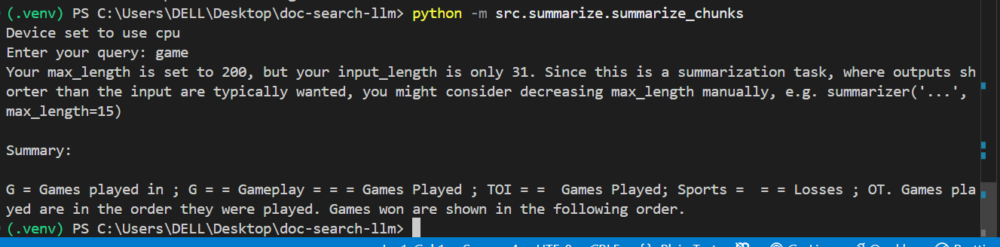

## Project Pipeline




```markdown
# Document Search and Summarization Using Large Language Models (LLM)

## Overview
This project demonstrates a pipeline to **search and summarize large textual data** using **Large Language Models (LLMs)** and **vector-based semantic search**.  

Key features:  
- Users can enter a query to retrieve the **most relevant document chunks**.  
- Retrieved chunks are summarized using an **LLM** for a concise overview.  
- Uses **FAISS** for fast semantic search with embeddings generated by **Sentence Transformers**.  

This system can be scaled to large datasets like Wikipedia or domain-specific corpora.

---

## Folder Structure

```

doc-search-llm/
├── .gitignore
├── requirements.txt
├── src/
│   ├── ingest/          # Scripts to download and preprocess data
│   │   ├── download_wiki.py      # Download small Wikipedia/Wikitext subset
│   │   └── preprocess_chunk.py   # Clean and split raw text into chunks
│   ├── embeddings/      # Embedding & FAISS index creation
│   │   └── build_faiss.py        # Generate embeddings and build FAISS index
│   ├── retrieval/       # Search scripts
│   │   └── search_index.py        # Query FAISS index and retrieve top chunks
│   └── summarize/       # Summarization scripts
│       └── summarize_chunks.py   # Summarize retrieved chunks using an LLM
├── data/                # NOT included in repo (ignored via .gitignore)
│   ├── raw/             # Raw dataset
│   └── processed/       # Preprocessed chunks & FAISS index
└── README.md

````

> Note: `data/` and `.venv/` are ignored to keep the repo small. Scripts allow anyone to **reproduce the dataset locally**.

---

## Setup Instructions

### 1. Clone the repository
```bash
git clone https://github.com/<your-username>/doc-search-llm.git
cd doc-search-llm
````

### 2. Create a virtual environment and activate it

```bash
python -m venv .venv
.venv\Scripts\activate      # Windows
# source .venv/bin/activate  # Linux / Mac
```

### 3. Install dependencies

```bash
pip install -r requirements.txt
```

---

## Workflow

### **Step 1 — Download dataset**

* Uses a small subset of Wikipedia/Wikitext to demonstrate functionality.

```bash
python src/ingest/download_wiki.py
```

* Files are saved in `data/raw/`.

### **Step 2 — Preprocess and chunk text**

* Cleans raw text and splits it into smaller chunks (~500 tokens each) for embeddings.

```bash
python src/ingest/preprocess_chunk.py
```

* Output stored in `data/processed/`.

### **Step 3 — Build embeddings and FAISS index**

* Converts text chunks into embeddings using **Sentence Transformers**.
* Builds a **FAISS index** for fast semantic search.

```bash
python src/embeddings/build_faiss.py
```

### **Step 4 — Search for relevant chunks**

* Query the FAISS index for top N relevant chunks.

```bash
python -m src.retrieval.search_index
```

* Example:

```
Enter your query: machine learning
```

* Returns the top relevant chunks matching your query.

### **Step 5 — Summarize retrieved chunks**

* Summarizes top chunks into a coherent text using an LLM.

```bash
python -m src.summarize.summarize_chunks
```

* Output is a concise summary of the retrieved documents.

---

## Notes / Best Practices

1. **Dataset**

   * `data/raw/` and `data/processed/` are **not included** in Git.
   * Anyone can generate it locally using the provided scripts.

2. **Chunking**

   * Helps avoid token limits of LLMs.
   * Each chunk is embedded separately for semantic search.

3. **Models**

   * Embeddings: `all-MiniLM-L6-v2` (fast & small)
   * Summarization: `facebook/bart-large-cnn` (local) or any LLM API (GPT-4, GPT-3.5)

4. **Customizations**

   * Adjust `CHUNK_SIZE` in `preprocess_chunk.py` for finer/coarser chunks.
   * Adjust `TOP_K` in `search_index.py` for more/fewer search results.
   * Summarization length can be tuned in `summarize_chunks.py`.

---

## How to Run End-to-End

1. Download dataset: `python src/ingest/download_wiki.py`
2. Preprocess and chunk: `python src/ingest/preprocess_chunk.py`
3. Build embeddings & FAISS index: `python src/embeddings/build_faiss.py`
4. Search: `python -m src.retrieval.search_index`
5. Summarize: `python -m src.summarize.summarize_chunks`

---

## References

* [Hugging Face Datasets](https://huggingface.co/docs/datasets/)
* [Sentence Transformers](https://www.sbert.net/)
* [FAISS](https://faiss.ai/)
* [Hugging Face Transformers](https://huggingface.co/docs/transformers/index)

---

## Author

Manthan Shetty
Assignment: Document Search & Summarization Using LLM

```


If you want, I can also **write a clean `requirements.txt`** ready for this repo so your assigners can just install it. Do you want me to do that?
```
